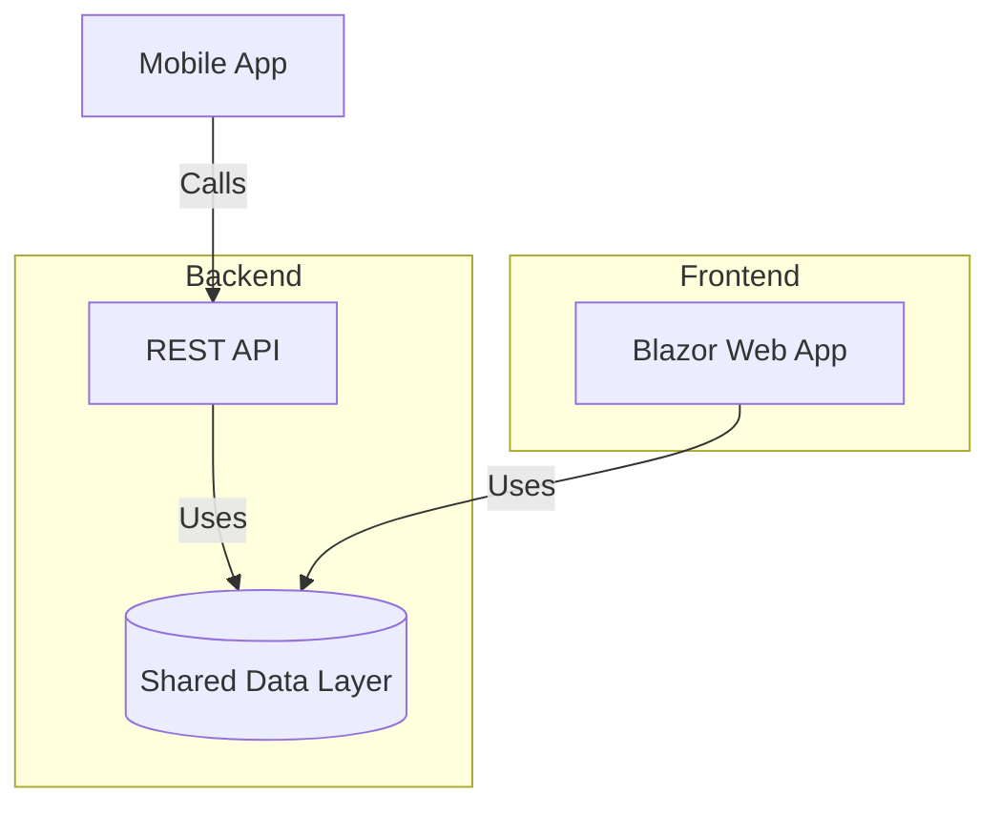

  # Mobile Backend with Web Frontend

This template is a boilerplate for a mobile backend, including all the basics to get started with authentication and essential endpoints. It also includes a web frontend, which can be omitted if not needed.




## API

The API is based on a REST architecture, primarily designed for mobile app connections.

### Features

- Sign in with Apple
- Sign in with Google (not implemented yet)
- Sign in with ... (to be determined)
- Sign in with username and password

### Endpoints

#### **UsersController**
- **GET /profile** – Returns the user's profile.
- **PUT /profile** – Replaces the current profile, except for credentials such as username, password, and tokens.
- **DELETE /profile** – Deletes the user profile.

#### **GdprController**
- **GET /all** – Returns all registered data. Needs to be updated when implementing additional data storage.
- **DELETE /data** – Deletes all stored user data without the possibility of recovery. This does not handle database backups, which must be implemented separately.

### **SystemController**
- **GET** return the app info with build number etc.
- **GET /.well-known/apple-app-site-association.json** Apple  App association file  
## Web Frontend

This is a standard **Blazor** web app, **server-rendered**, using **Bootstrap** for styling. 

The basic sign-in features are implemented using Microsoft's standard login setup.

# Usage
You can install the template by navigating to the root of the template and run

```dotnet new install .```

# 📜 License

This project is licensed under the MIT License. You are free to use, modify, and distribute the software, provided that you give appropriate credit to the original author, Per Friis.

The software is provided “as is”, without any warranties. See the full license text in the LICENSE.md file.

Dette giver en klar og kortfattet beskrivelse af licensbetingelserne samt en direkte henvisning til den fulde licenstekst.

